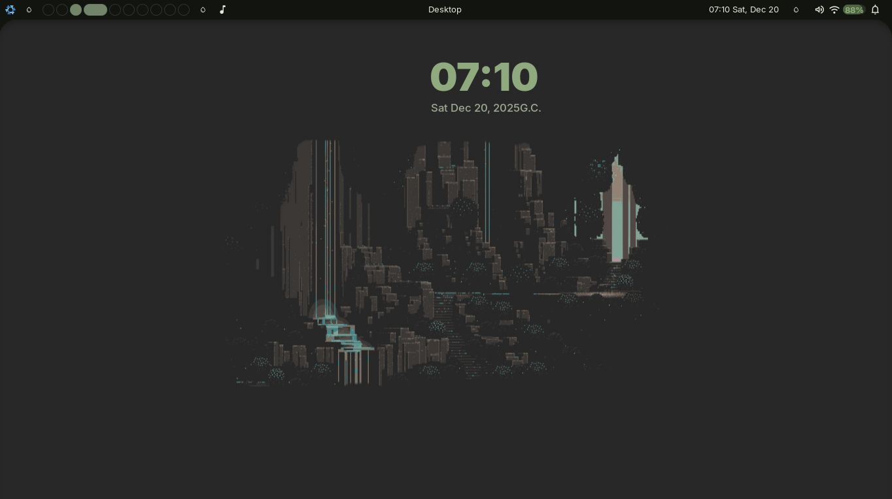
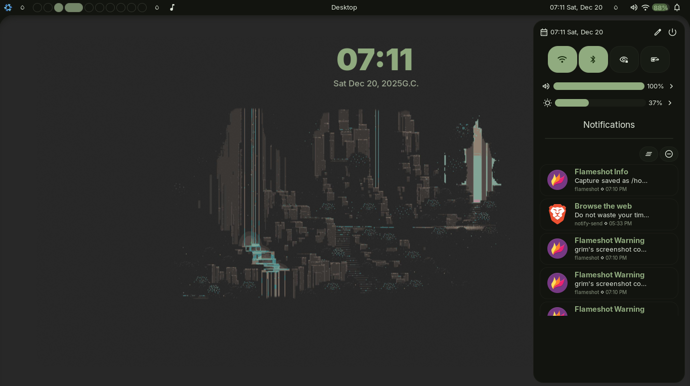
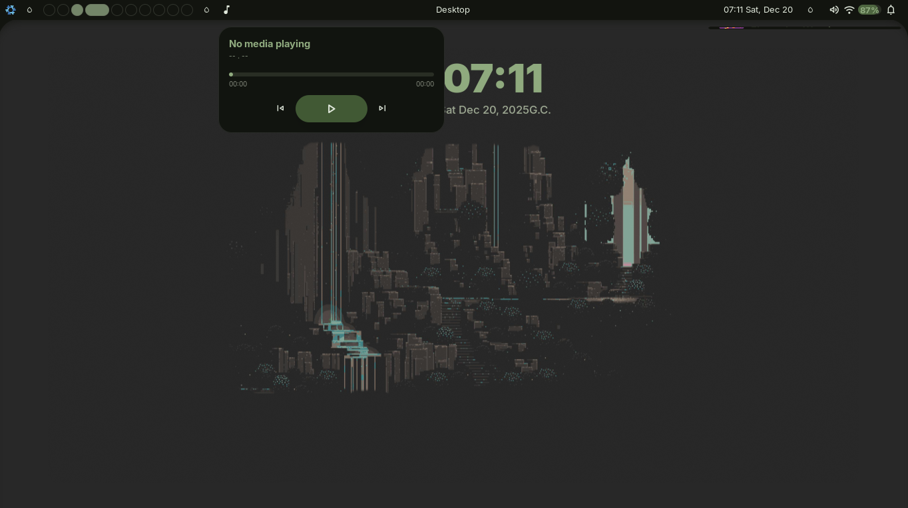

# Wigo

wigo is a widget system written in Go.
It currently uses eee as its frontend, with plans to migrate to a pure **gotk4-layer-shell** or **gotk3-layer-shell** implementation in the future. Wigo acts as the main controller and wrapper around Eww.

## Showcase

<p align="center">
  
  
  
</p>

## Installation

```sh
git clone git@github.com:hoppxi/wigo.git
cd wigo

chmod +x ./scripts/build.sh
./scripts/build.sh

# run the setup
wigo setup

# run wigo
wigo start &! # run the widgets
wigo notification &! # run the notification daemon; make sure there is no other daemon is running.

wigo help # for furthur exploration.
```

### NixOS

```sh
nix develop

wigo setup
wigo start &!
```

To add Wigo as an input:

```nix
inputs.wigo.url = "github:hoppxi/wigo";

# Then in your configuration:
home.packages = [
  inputs.wigo.packages.${pkgs.system}.default
];
```


### Non-NixOS

If you are **not** on NixOS, make sure you have the following installed:

* Hyprland
* eww
* cliphist
* pactl
* wl-clipboard
* zenity
* hyprsunset

Then proceed with the installation:

```sh
git clone git@github.com:hoppxi/wigo.git
cd wigo

chmod +x ./scripts/build.sh
./scripts/build.sh

# run the setup
wigo setup

# run wigo
wigo start &!          # start widgets
wigo notification &!  # start notification daemon (make sure no other daemon is running)

wigo help              # for further exploration
```

## Features

Wigo includes many built-in components, especially in the launcher:

* Emoji picker
* Clipboard manager
* Extension support
* App launcher
* Binary launcher
* Google search
* YouTube search
* Translation
* And more

You can find example configuration files at: **config/wigo.yaml**
