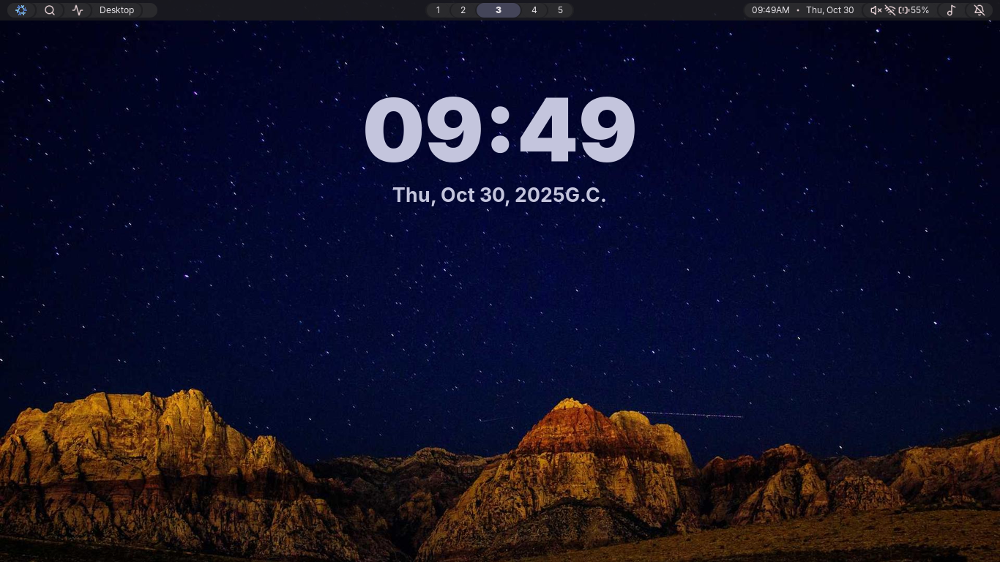
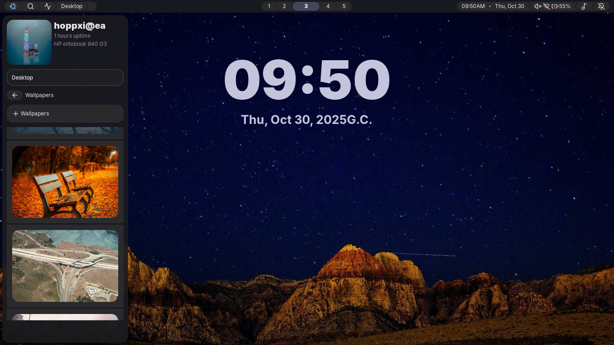

# Niv

Just making some widget built with Go and `EWW` for Hyprland. No big deal :)

# Show case

|   |   |
| --------------------------------------------------------------- | --------------------------------------------------------------- |
|   |   |
| --------------------------------------------------------------  | --------------------------------------------------------------  |
|   |   |
| --------------------------------------------------------------  | --------------------------------------------------------------  |
|   |   |
| --------------------------------------------------------------  | --------------------------------------------------------------  |
|   |  |
| --------------------------------------------------------------  | --------------------------------------------------------------  |
|  |  |
| --------------------------------------------------------------  | --------------------------------------------------------------  |
|  |  |
| --------------------------------------------------------------  | --------------------------------------------------------------  |

# Not fully done

- Mostly it is done, but the dynamic data is not yet implemented and I am working on it.

# Dependecies

- this widget is made with EWW and Go. So you will need preinstalled eww and to build the binaries you will need go.

1. system

- nmcli
- wpctl (Pipewire),
- UPower

2. others

- brightnessctl
- swaync (notification daemon)
- swww (wallpaper)

3. fallback

- pamixer
- ethtool

# installation

- Note: made and tested on 1366x768 monitor
- after installing dependecies continue with installtion

1. Clone the repo to ~/.config/eww

```bash
  cd ~/.config/eww
  git clone https://github.com/hoppxi/niv.git

```

2. build binaries

```bash
  chmod +x ./scripts/*

  ./scripts/build.sh
```

3. start niv

```bash
  ./bin/niv start
```

- for easier start put the binary in hyprland exec

```conf
; in your hyprland config
exec-once = ~/.config/eww/bin/niv start
```

4. if widgets are not being closed

```bash
  # run
  ~/.config/eww/bin/niv close # or  `pkill eww`

  # to restart
  ~/.config/eww/bin/niv restart
```
